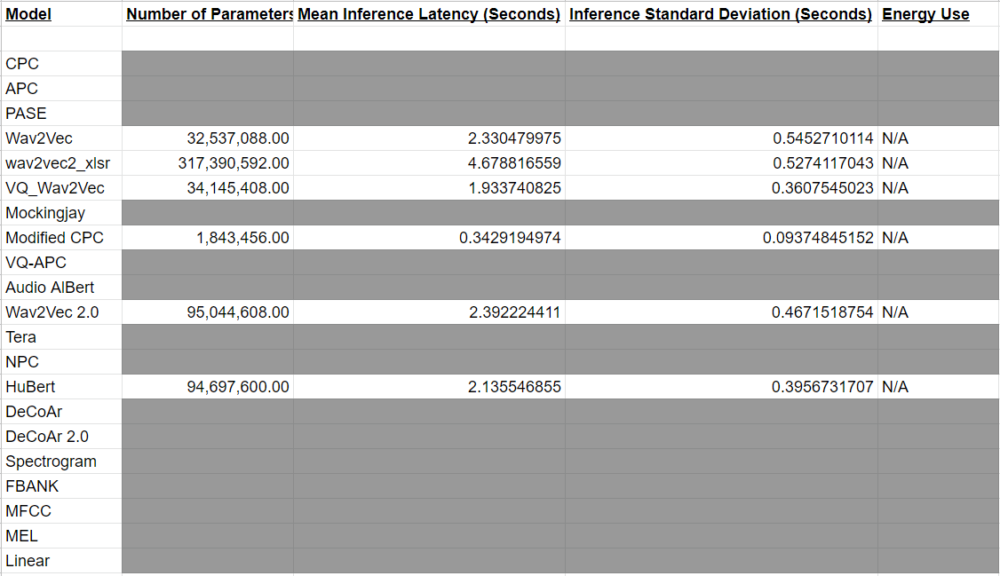
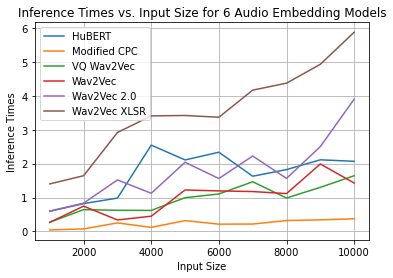

Lab 2: Benchmarking
===
The goal of this lab is for you to benchmark and compare model inference efficiency on your devices. **You should benchmark 2*N* models or model variants, where *N* is the size of your group (so, two models per person.)** For now, if you don't have appropriate evaluation data in place that's fine; you can provide pretend data to the model for now and just evaluate efficiency.

Ideally, the models you benchmark will be related to and useful for your class project, but at the very least the efficiency metrics should be useful.

Include any code you write to perform this benchmarking in your Canvas submission (either as a link to a folder on github, in a shared drive, zip, etc).

Group name:
---
Group members present in lab today: Alex, Bassam, Navya

1: Models
----
1. Which models and/or model variants will your group be benchmarking? Please be specific.

We will be using the following audio embedding models: wav2vec, wav2vec 2.0, wav2vec_xlsr, vq_wav2vec, Modified_cpc, and HuBERT.  

This link gave a pretty comprehensive breakdown of the different audio embedding models that are available and how they differ: https://github.com/s3prl/s3prl


2. Why did you choose these models?

We intended to use some of the larger transformer models for our audio embedding such as Mockingjay, Tera, and AudioAlbert however but we were forced to limit our scope of model choices because of dependency issues with the s3prl speech toolkit library. Alex discovered that several of the models (mentioned above) require the `mkl_fft` library which is only available on Intel platforms. This limits the models available to us since our device has an ARM processor.

After experimenting with the models that we could actually use with the s3prl unified framework, we found that the 6 models mentioned before are what we can use.


3. For each model, you will measure parameter count, inference latency, and energy use. For latency and energy, you will also be varying a parameter such as input size or batch size. What are your hypotheses for how the models will compare according to these metrics? Do you think latency will track with energy use, and parameter count? Explain.

We think that some of the more lightweight models, or at least those based on conventional methods of audio analysis, such as Log Mel or wav2vec 2.0 will have a lower parameter count, lower latency, and thus lower energy usage when producing the embedding.

2: Parameter count
----
1. Compute the number of parameters in each model. Remember, in Torch you should be able to start with something like this:
   ```
   num_params = sum([np.prod(p.size()) for p in model.parameters()])
   ```
   Report your results in a table.

<!-- Insert image here containing the parameter numbers of our models -->



2. Does this number account for any parameter sharing that might be part of the model you're benchmarking?

I don't think so. `model.parameters()` in PyTorch returns the number of trainable parameters which may not include shared weights.


3. Any difficulties you encountered here? Why or why not?

Nope. This was pretty straightforward.


3: Latency
----
1. Compute the inference latency of each model. You should do this by timing the forward pass only. For example, using `timeit`:
    ```
    from timeit import default_timer as timer

    start = timer()
    # ...
    end = timer()
    print(end - start) # Time in seconds, e.g. 5.38091952400282
    ```
    Best practice is to not include the first pass in timing, since it may include data loading, caching, etc.* and to report the mean and standard deviation of *k* repetitions. For the purposes of this lab, *k*=10 is reasonable. (If standard deviation is high, you may want to run more repetitions. If it is low, you might be able to get away with fewer repetitions.)
    
    For more information on `timeit` and measuring elapsed time in Python, you may want to refer to [this Stack Overflow post](https://stackoverflow.com/questions/7370801/how-to-measure-elapsed-time-in-python).


2. Repeat this, varying one of: batch size, input size, other. Plot the results (sorry this isn't a notebook):
   ```
   import matplotlib.pyplot as plt
   
   plot_fname = "plot.png"
   x = ... # e.g. batch sizes
   y = ... # mean timings
   
   plt.plot(x, y, 'o')
   plt.xlabel('e.g. batch size')
   plt.ylabel('efficiency metric')
   plt.savefig(plot_fname)
   # or plot.show() if you e.g. copy results to laptop
   ```

We decided to vary the input size to our model and then measure inference times.

<!-- Put plot of latencies here -->



4. Any difficulties you encountered here? Why or why not?

Yes. We found that some of the models were so big that we had to delete them from the cache in order to load and test others. Also, we encountered very long load times in just loading some of the models to the cache. After that though, the inference times for our models were quick and the rest of the tests ran pretty smoothly.


4: Energy use
----
1. Compute the energy use of each model. You can use the `powertop` tool on RPi and Jetson (must be run as root):
    
    We are not able to compute the energy consumption on our Jetson 2GB nano device since it doesn't have the required power sensor controller. 

2. Any difficulties you encountered here? Why or why not?

We installed jtop on our jetson device. We used the python script(provided by Nvidia) to track the power consumption using jtop, but it did not give any power output in the logs as the device doesn't have the required power controller. We also looked into the Nvidia documentation on software based power consumtion modelling. The original Jetson Nano have a three-channel INA3221 power monitor at I2C address 0x40. We tried to read power information directly from the sysfs nodes mapped to the power interface, but got the error that the folder('/sys/bus/i2c/drivers/ina3221x/6-0040/iio\:device0/in_power2_input") doesn't exist. 


5: Discussion
----
1. Analyze the results. Do they support your hypotheses? Why or why not? Did you notice any strange or unexpected behavior? What might be the underlying reasons for that behavior?


5: Extra
----
A few options:
1. Compute FLOPs for each of your models. If you're using Transformer-based models, you might be able to use or modify the [`flops_counter.py`]() script in this directory. If you're using a CNN-based model, then you might be able to use or modify code in [this project](https://github.com/1adrianb/pytorch-estimate-flops) or similar. 
2. Evaluate on different hardware (for example, you might run the same benchmarking on your laptop.) Compare the results to benchmarking on your device(s).
3. Use real evaluation data and compare accuracy vs. efficiency. Describe your experimental setup in detail (e.g. did you control for input size? Batch size? Are you reporting average efficiency across all examples in the dev set?) Which model(s) appear to have the best trade-off? Do these results differ from benchmarking with synthetic data? Why or why not?

----
\* There are exceptions to this rule, where it may be important to include data loading in benchmarking, depending on the specific application and expected use cases. For the purposes of this lab, we want to isolate any data loading from the inference time due to model computation.
