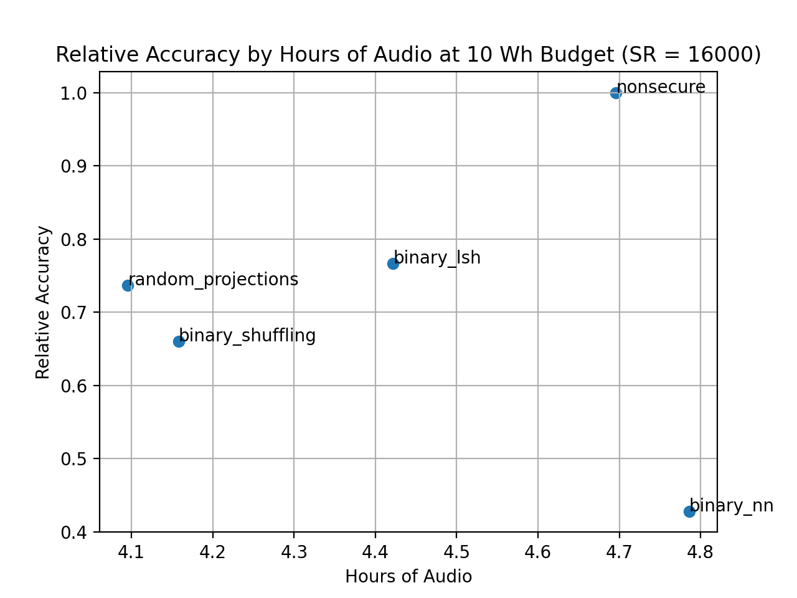

Lab 9: Carbon footprint
===
The goal of this lab is for you estimate the carbon footprint of your class project.

Group name: Macrosoft
---
Group members present in lab today: Alex, Navya, Bassam

1: Inference
----
1. Plug your device in to the Kill-a-watt and run inference using your model to get a measurement of the energy draw. What is its baseline energy draw, and how does that compare to running inference?

Baseline energy draw from the device is around 2.5-3 Watts. Running inference gives a fairly consistent energy draw of around 7.2 Watts across the time of inference. 

2. Multiply energy draw by inference time to get an estimate of energy required per inference (you can average over input size).

All the methods our group is studying need to load the embedding model, load the audio, and embed all segments in that audio file. This process takes 83.86 seconds on device, equating to 603.80 Watt Seconds. To get a sense of additional power required to process any given audio sequence, we plotted normalized inference time which is defined as time to classify an entire audio file divided by the length of that audio. The units here are in seconds of processing time over seconds of audio. Over all attempted sampling rates, we see the following:

If we look at just 16000, we see

We can multiply by our power factor to get

Given that our preprocessing power draw is 603.80 Watt Seconds and assuming we are processing one long audio file, and one Watt Hour is 3600 Watt Seconds, we have a budget of 10 * 3600 - 306.80 = 35,693.2 Watt Seconds to run inference. 

This gives us the following plot for a budget of 10 Wh.

Note that we plot accuracy against hours of audio instead of inference runs since our input data is inherently sequential, so it is more intuitive to look at the longest sequences we can process at a given power budget. 

We can also estimate the power required to run inference on one hour of audio, giving the following result:

3. Multiply this by the carbon intensity of the location of your device. You can use [this resource](https://www.epa.gov/egrid/power-profiler#/).

The carbon intensity of RFCW is 1.0677 Lbs/kWh. Thus we get the following data on the emissions of each method:

4. Please include at least this estimate in your final project report.

2: Training
----
1. Did your project require training a model? If so, compute that estimate as well. If you used cloud resources, you can use [this tool](https://mlco2.github.io/impact/#compute) to help estimate. Otherwise, try to use the methods discussed last class for estmating carbon footprint due to training. Show your work and explain.

Our method did not require training a model. 

3: Extra
----
1. Everything else: Do you have logs you can use to estimate the amount of energy + carbon that went in to all project development? Other ways of estimating? Was your device plugged in and running for the entire semester?

To get the benchmarks used in this report and the final report, the script took 9628 minutes. Thus, we can estimate the entire power draw for creating this report in particular is 1,155.36 Watt Hours, or 1.15536 kWhs. This gives .8 lbs of C02 emitted for this report. We let the device plugged in almost all semester (probably 3 months total), which gives 6,480 Watt hours, or 6.48 kWh, emitting 6.92 Lbs of C02. 

2. Supply chain / lifecycle analysis: Can you estimate the additional footprint due to manufacturing hardware? Lifetime energy use of your project if it was deployed in the real world?

3. If you have a Pi or Jetson 4GB: Compare Kill-a-watt measurements to command line energy measurements, and discuuss.

We have a Jetson 2GB.